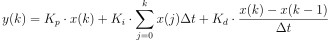
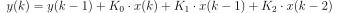
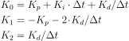

# CarND-Controls-PID
Self-Driving Car Engineer Nanodegree Program

---

## Dependencies

* cmake >= 3.5
 * All OSes: [click here for installation instructions](https://cmake.org/install/)
* make >= 4.1(mac, linux), 3.81(Windows)
  * Linux: make is installed by default on most Linux distros
  * Mac: [install Xcode command line tools to get make](https://developer.apple.com/xcode/features/)
  * Windows: [Click here for installation instructions](http://gnuwin32.sourceforge.net/packages/make.htm)
* gcc/g++ >= 5.4
  * Linux: gcc / g++ is installed by default on most Linux distros
  * Mac: same deal as make - [install Xcode command line tools]((https://developer.apple.com/xcode/features/)
  * Windows: recommend using [MinGW](http://www.mingw.org/)
* [uWebSockets](https://github.com/uWebSockets/uWebSockets)
  * Run either `./install-mac.sh` or `./install-ubuntu.sh`.
  * If you install from source, checkout to commit `e94b6e1`, i.e.
    ```
    git clone https://github.com/uWebSockets/uWebSockets 
    cd uWebSockets
    git checkout e94b6e1
    ```
    Some function signatures have changed in v0.14.x. See [this PR](https://github.com/udacity/CarND-MPC-Project/pull/3) for more details.
* Simulator. You can download these from the [project intro page](https://github.com/udacity/self-driving-car-sim/releases) in the classroom.

Fellow students have put together a guide to Windows set-up for the project [here](https://s3-us-west-1.amazonaws.com/udacity-selfdrivingcar/files/Kidnapped_Vehicle_Windows_Setup.pdf) if the environment you have set up for the Sensor Fusion projects does not work for this project. There's also an experimental patch for windows in this [PR](https://github.com/udacity/CarND-PID-Control-Project/pull/3).

## Basic Build Instructions

1. Clone this repo.
2. Make a build directory: `mkdir build && cd build`
3. Compile: `cmake .. && make`
4. Run it: `./pid`. 

Tips for setting up your environment can be found [here](https://classroom.udacity.com/nanodegrees/nd013/parts/40f38239-66b6-46ec-ae68-03afd8a601c8/modules/0949fca6-b379-42af-a919-ee50aa304e6a/lessons/f758c44c-5e40-4e01-93b5-1a82aa4e044f/concepts/23d376c7-0195-4276-bdf0-e02f1f3c665d)

--- 

# PID Controller Development

## Controller implementation

As the PID has to be implemented in discrete form on a computer, some form of approximation has to applied. On this project I used the simple backward euler, which basically approximates the derivative based on two samples. I also transformed the classic PID structure:



Into its incremental version:



where



On the implementation, the parameters are first calculated and stored:
```C++
  coefs_[0] = Kp + dt * Ki + Kd / dt;
  coefs_[1] = -(Kp + 2 * Kd / dt);
  coefs_[2] = Kd / dt;
```
And the output is updated using a circular buffer:
```C++
  for (u_int8_t i = 0; i < 3; ++i)
    output_ += coefs_[i] * measurements_[(sample_index_ + i) % 3];
```

## PID Tuning

I manually tuned the PID (via trial and error), the idea of using an automated algorithm without a way to "reset" the simulation adds too much complexity.

### Proportional

I started by just running the system to evaluate the order of magnitude of the error and the steering value. I realised that the steering could be one order of magnitude smaller than the error, that way I started with a proportional gain of **0.1**. This choice was able to make the car run forward for a while before going too instable.

### Derivative

I then moved to the derivative gain to be able to stabilize (dump) the system. I started with the derivative gain similar to the proportional one, but had to raise it to **0.4** to have the system stable enough to do a full lap.

### Integral

I'm not sure that there is a intrinsic bias in the simulation, so a used a very low value for the integral gain. I also expect it to help on long curve, but there is none in this simulation.

## Fine Tuning

The system was already able to run and I had implemented a PID for the speed in a similar way. But the system was still oscilating too much, and I realise that part of the reason for the oscilation is that the system was not responding fast enough to the changes in curvature. That way I decided to increase the proportinal gain (and the derivative gain the same way). After a little back and fourth with these two values the car reach a state where it is reasonable sabe to be inside. 
